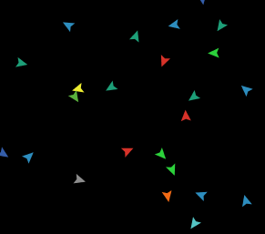

<iframe id="NetlogoModel" width="1200" height="1400" src="https://sandermiller.github.io/CompRobo2020Swarms/boidsFlocking.html" frameborder="0"></iframe>

## Project Overview
The goal of our project was to gain a deeper understanding of decentralized multi-agent systems and collective behaviour through the implementation 
of Boid's flocking algorithm. Boid's flocking algorithm is an algorithm for allowing a set of independent agents to flock together and mimic the behavior of flocking animals seen in nature, such as schools of fish, or swarming bats. This algorithm is an example of swarm robotics, the study of creating robots that can work together to mimic the behavior of collective systems. In this project we focused on implementing the algorithm to learn about decentralized control of a robotic swarm. Decentralized control is a system where the swarm behaviors of the robots are built up as emergent properties from simple rules that each agent follows. Decentralized control greater mimics the behavior of animal swarms in that it relies on each agent acting on the same rules without taking commands from an outside source to act, in the same way that there is no central intelligence dictating swarming behavior in animals, there is no central processor dictating the swarming behavior in the robotic flock.  

## Selecting a Modeling Platform
We were primarily interested in analyzing the collective behaviour of a swarm. In order to minimize unnecessary complexity we looked for a platform made for agent-based modeling, rather than a physics based platform such as Gazebo. we also wanted to abstract the system a bit to be able to focus on the broad actions rathr than having to deal with the particulars of which sensors the robots would have and how to communicate between the sensors and the motors thought ROS commands. We ended up choosing [NetLogo](https://ccl.northwestern.edu/netlogo/) for its built in graphical user interface and visualization. Net logo also alows computations to occur spacially beased on agents in proximity so it provided a good platform for abstracting the sensor readings and implementing a distributed swarm robotics algorithm. These features allowed us to begin working on the model behaviour on day one. Although NetLogo uses its own programming language, we found that the NetLogo [programming guide](https://ccl.northwestern.edu/netlogo/5.3.0/programming.html) and [dictionary](http://ccl.northwestern.edu/netlogo/docs/index2.html) made the transition to a new language relatively easy.

## Our Agents

  

The agents used in our simulation have three properties, **color**, **speed**, and **heading**. They have no sense of their absolute position within the map.
They are also able to **sense, localize, and transfer information** to any other agents within a given radius. It should be noted that the agents localize one another in their respective coordinate systems rather than in a global reference frame.

As we are investigating decentralized systems, all of our agents run identical code. In order to help visualize and identify distinct flocks we created the `colorizeSwarms()` function. This function causes each agent to become the most frequent color shared by its neighbors. If there are no other agents within visibility range the agent continuously changes random colors.

## Implementation of Boids Algorithm

### Separation
The first rule of Boids algorithm says that **agents too close together will turn away from each other** to spread out.

Our separation radius is defined as a percentage of the visibility radius. Any agents within this radius are considered too close. In order to maintain spacing the separation function provides the heading directly away from the center of mass of agents within the separation radius. Due to the decentralized architecture of the swarm the agents are unaware of their absolute position. Instead we can track visible flockmates positions as a polar coordinates (distance and angle) with respect to a given agent. These polar coordinates are converted to cartesian coordinates using the equations _x = r * cos(θ)_ and _y = r * sin(θ)_. The x and y coordinates for each flock member are added together and then averaged. This gives us the _x_ and _y_ coordinates of the flock's center of mass with respect to a given agent. In order to get the heading to the center of mass we simply take the inverse tangent of the average y coordinate over the average x coordinate. Because the goal of separation is to move away from the center of mass we can calculate the heading directly away by adding 180 to the heading directly toward the center of mass, and taking the modulus 360 to remap the heading to the range 0 to 360.
This heading is fed into our steering function.

  

### Alignment
The second rule of Boids algorithm is that **agents within a flock should turn towards the average heading** of the flock. 

To do this we calculated the average heading of all agents within the visibility radius of each agent. In NetLogo headings are given in degrees between 0 and 360. 
To calculate the average heading of the flock we first found the corresponding average _x_ and _y_ values of the heading angles by taking the sum of the _cos_ and _sin_ of each heading, then dividing by the number visible agents within the flock. Then we took the inverse tangent of the average y value over the average x value. This heading is fed into our steering function.

An example of calculating the average flock heading can be shown below.

  

### Cohesion
The third rule of Boids algorithm says that **agents should steer toward the flock's center of mass**.

Cohesion is very simlar to separation, except that we account for all agents within the full visibility radius, and we head toward the center of mass, rather than away from it. We calculating the center of mass of all visible agents the same way as before using the equations _x = r * cos(θ)_ and _y = r * sin(θ)_ to convert the positions from polar to cartesian. Then we again take the average x and y coordinate by summing up all of the x's and y's and dividing by the total number of agents. In order to get the heading to the center of mass we simply take the inverse tangent of the average y coordinate over the average x coordinate.
This heading is fed into our steering function.

  

### Steering
Finally we add the three calculated headings, separation, alignment, and cohesion, as vectors scaled by their weights. This gives us a net heading for which the agent should steers towards.

  

Once the net heading is calculated we must determine whether the agent must turn left or right. To do this we first find the difference between the agent's current heading and the net heading `currentHeading - netHeading`. Then this difference is mapped into the range of -180 to 180 degrees.

        if difference < -180
          difference += 360
        elif difference > 180
          difference -= 360

Finally, if this remapped difference is negative we turn the agent right, and if the remapped difference is positive we turn the agent left.

## Adding Predators

### Inspiration

Once we got the base implementation of the flocking behavior implemented we wanted to extend the simulation. The Boid's flocking algorithm effectively mimics the flocking/schooling of fish. We decided to add in the behavior of avoiding predators as in real fish schooling this behavior significantly impacts the shape of schools.

We can see the real world behavior we were attempting to replicate in the video above. As we can see the fish school kind of forms large open tunnels where the sharks swim through the school. 

### Implementation

The fundamental behavior of avoiding predators is implemented in the same manner as the separation component of the base boid's algorithm. When a predator gets too close to the prey, the prey will correct towards the heading which points directly away form the predator. To mimic the panicked behavior of the fish when this occurs we added two components to this. Firstly the correction way from the predator is of a more severe angle then any of the flocking corrections which results in a more dramatic behavior rather then the gradual course adjustment underlying the flocking behaviors. Secondly we made escaping the predator take precedence over the flocking alignment behaviors. This means that the prey will prioritize corrections away from the predator as a replacement for corrections towards their flock or away from other prey until the fish is sufficiently far away from the predator that it returns to normal behavior. 

To allow the prey to distinguish the predators the predators are initialized separately and stored as a separate agent set. This means that the prey will perform flocking behaviors only with other prey and this prevents fish attempting to flock or color match with predators. Predators are agents which follow separate rules and so we denoted predators with a red arrow, a different color and shape from the prey. We had predators follow the same random pathing behavior that the fish have when not flocking so that the predators will naturally wander the space and the prey flocks will avoid the predators.

### Difficulties

Firstly we ran into the problem that predators and prey had the same speed this led to behaviors where flocks of prey would get 'stuck' in front of the predator constantly running away in the direction of the predator's movement but the state would continue until the predator turned away. IN the real world predators, especially sharks of the inspiration material, are stronger and faster than their prey so they tend to outpace the prey and catch them. To rectify this we made the predator move at a multiple of 1.2 times the speed of the prey. This meant that the predator would catch up with the prey in a chase scenario. As a result of this the prey would be forced to veer off course more to escape the predator.

Secondly, we noticed that the prey were not really behaving in the same manner as we had observed in the video. The predators tended to 'snowplough' the prey out of the way running into them and forcing them out of the way , rather than the wide swaths around the predators we see in the inspiration.
[TODO: gif of snowplough behavior]
 To solve this we realized that predators are often larger than the prey, and so prey are able to spot them from further away than they are able to recognise fellow flock members. To replicate this we increased the recognition radius for the predators relative to the recognition radius for fellow flockmates. The result of this was that prey seemed to part in swaths for the predator similar to how we can see in the inspiration.
[todo gif of normal behavior]  

## Collective Behaviours

It was very interesting how many different collective behaviours we could create by adjusting the separation, alignment and cohesion weights.

Here is one example where if the cohesion weight is suddenly increased significantly while the alignment and separation weights remain relatively low, the flocks will get stuck in an infinite loop circling each other. This could be useful if for whatever reason you wanted your swarms to converge and hold one spot.

   

## Next Steps
We have created a very solid baseline for modeling swarm behaviour, but there are many ways our model can be improved and built upon. One new feature that we were initially planning on implementing was shape formation of our flocks such as forming V's like migrating birds. Another idea would be to make our model better replicate real physics. In our model agents can pass through each other, a good next step would be to add collision detection to the model. A third potential idea is to make the predators more intelligent. Currently they move through the map blindly and randomly. It could be interesting to have the predators be able to sense and chase the prey around.

## Conclusion
We are very happy with our implementation and the results we got. Through the process we learned first hand just how difficult it is to 

